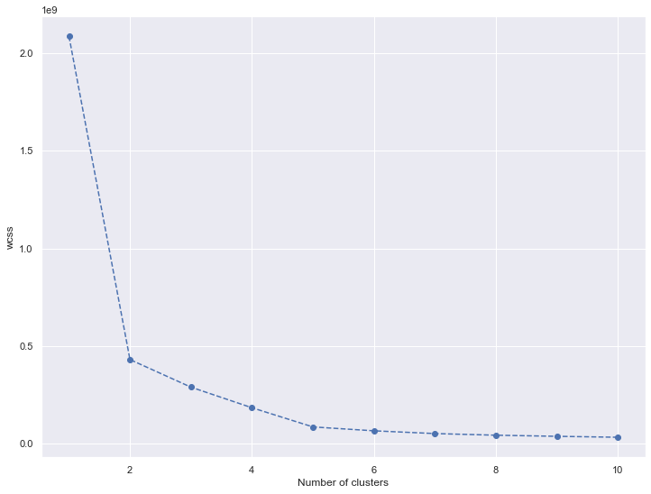
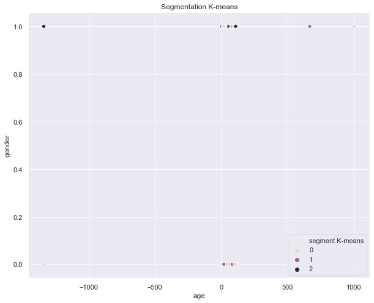
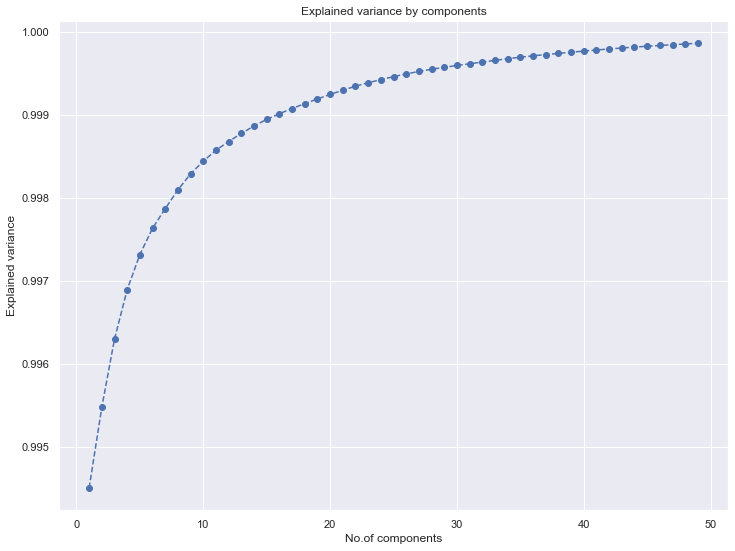
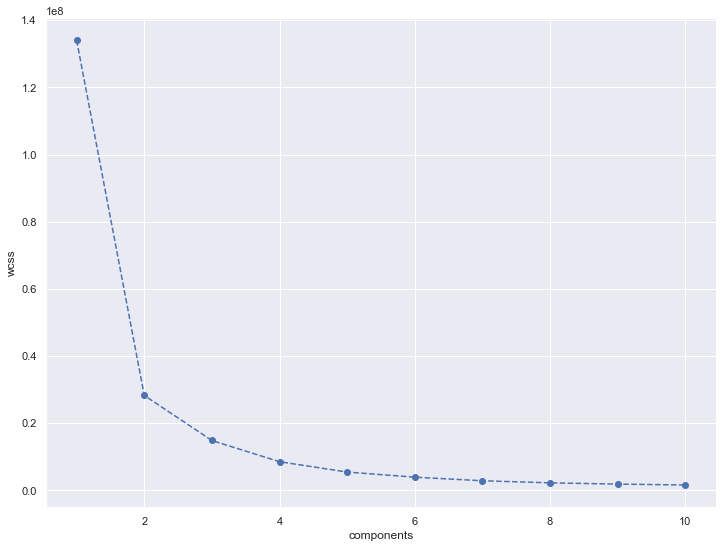
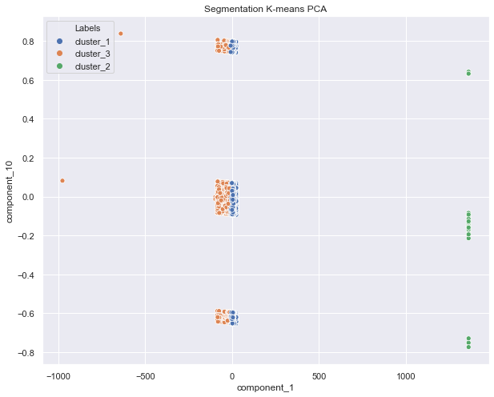

# User Segmentation using Clustering Techniques

Customer Segmentation is one the most important applications of unsupervised learning. Using clustering techniques, one can identify the several segments of customers allowing them to target the potential user base.


This notebook has the following sections

1. Importing Necessary Libraries
2. Loading the data
3. Exploratory Data Analysis
4. Applying clustering Techniques
5. Finding the optimal Clusters
6. Applying PCA
7. Find the optimal clusters 
8. Visualization of clusters


#### 1. Importing the libraries


```python
import numpy as np
import pandas as pd

# for standardizing the dataset
from sklearn.preprocessing import StandardScaler

# for visualization
import matplotlib.pyplot as plt
import seaborn as sns
sns.set()

# for the clustering techniques
from scipy.cluster.hierarchy import dendrogram,linkage
from sklearn.cluster import KMeans
```

#### Loading the dataset


```python
df_users=pd.read_csv('user_side_data_raw.tsv',sep='\t',names=['id','gender','age','country','date'])
```


```python
df_users.head()
```


<div>
<style scoped>
    .dataframe tbody tr th:only-of-type {
        vertical-align: middle;
    }

    .dataframe tbody tr th {
        vertical-align: top;
    }

    .dataframe thead th {
        text-align: right;
    }
</style>
<table border="1" class="dataframe">
  <thead>
    <tr style="text-align: right;">
      <th></th>
      <th>id</th>
      <th>gender</th>
      <th>age</th>
      <th>country</th>
      <th>date</th>
    </tr>
  </thead>
  <tbody>
    <tr>
      <th>0</th>
      <td>00000c289a1829a808ac09c00daf10bc3c4e223b</td>
      <td>f</td>
      <td>22.0</td>
      <td>Germany</td>
      <td>Feb 1, 2007</td>
    </tr>
    <tr>
      <th>1</th>
      <td>00001411dc427966b17297bf4d69e7e193135d89</td>
      <td>f</td>
      <td>NaN</td>
      <td>Canada</td>
      <td>Dec 4, 2007</td>
    </tr>
    <tr>
      <th>2</th>
      <td>00004d2ac9316e22dc007ab2243d6fcb239e707d</td>
      <td>NaN</td>
      <td>NaN</td>
      <td>Germany</td>
      <td>Sep 1, 2006</td>
    </tr>
    <tr>
      <th>3</th>
      <td>000063d3fe1cf2ba248b9e3c3f0334845a27a6bf</td>
      <td>m</td>
      <td>19.0</td>
      <td>Mexico</td>
      <td>Apr 28, 2008</td>
    </tr>
    <tr>
      <th>4</th>
      <td>00007a47085b9aab8af55f52ec8846ac479ac4fe</td>
      <td>m</td>
      <td>28.0</td>
      <td>United States</td>
      <td>Jan 27, 2006</td>
    </tr>
  </tbody>
</table>
</div>


```python
df_users.shape
```


    (359347, 5)


```python
df_users.isnull().sum()
```


    id             0
    gender     32775
    age        74900
    country        0
    date           0
    dtype: int64


```python
# proportions of null values
(df_users.gender.isnull().sum()/df_users.shape[0])*100
```


    9.12071062232327


```python
(df_users.age.isnull().sum()/df_users.shape[0])*100
```


    20.84336310029025


```python
df_users.gender.fillna(df_users.gender.mode()[0],inplace=True)
```


```python
df_users.age.fillna(int(df_users.age.mean()),inplace=True)
```


```python
df_users.isnull().sum()
```


    id         0
    gender     0
    age        0
    country    0
    date       0
    dtype: int64


# Exploratory data analysis


```python
df_users.gender.value_counts()
```


    m    274417
    f     84930
    Name: gender, dtype: int64


```python
df_users.age.mean()
```


    25.07761022076155


```python
df_users.country.value_counts()
```


    United States               67044
    Germany                     31651
    United Kingdom              29902
    Poland                      20987
    Russian Federation          19833
    Brazil                      14534
    Sweden                      13122
    Spain                       13051
    Finland                     11579
    Netherlands                  9650
    Canada                       8679
    France                       7529
    Italy                        7525
    Australia                    7135
    Japan                        6637
    Turkey                       6452
    Norway                       5155
    Mexico                       4834
    Czech Republic               4774
    Ukraine                      4396
    Belgium                      3803
    Portugal                     3196
    Switzerland                  3053
    Bulgaria                     2800
    Austria                      2796
    Chile                        2794
    Argentina                    2640
    Romania                      2636
    Denmark                      2508
    Hungary                      1985
                                ...  
    Equatorial Guinea              10
    Saint Kitts and Nevis          10
    San Marino                      9
    Cameroon                        9
    Namibia                         9
    Senegal                         9
    Saint Lucia                     8
    Rwanda                          8
    Gabon                           8
    Comoros                         8
    Mayotte                         8
    Tonga                           8
    Grenada                         7
    Myanmar                         7
    Mali                            7
    Malawi                          6
    Belize                          6
    Eritrea                         6
    Guinea-Bissau                   5
    Central African Republic        5
    Sudan                           5
    Guyana                          5
    Suriname                        5
    Mauritania                      5
    Marshall Islands                4
    French Guiana                   4
    Palau                           3
    Benin                           3
    Liberia                         3
    Gambia                          3
    Name: country, Length: 239, dtype: int64


```python
df_users['joined year']=df_users.date.apply(lambda x:x[-4:])
```


```python
df_users.head()
```


<div>
<style scoped>
    .dataframe tbody tr th:only-of-type {
        vertical-align: middle;
    }

    .dataframe tbody tr th {
        vertical-align: top;
    }

    .dataframe thead th {
        text-align: right;
    }
</style>
<table border="1" class="dataframe">
  <thead>
    <tr style="text-align: right;">
      <th></th>
      <th>id</th>
      <th>gender</th>
      <th>age</th>
      <th>country</th>
      <th>date</th>
      <th>joined year</th>
    </tr>
  </thead>
  <tbody>
    <tr>
      <th>0</th>
      <td>00000c289a1829a808ac09c00daf10bc3c4e223b</td>
      <td>f</td>
      <td>22.0</td>
      <td>Germany</td>
      <td>Feb 1, 2007</td>
      <td>2007</td>
    </tr>
    <tr>
      <th>1</th>
      <td>00001411dc427966b17297bf4d69e7e193135d89</td>
      <td>f</td>
      <td>25.0</td>
      <td>Canada</td>
      <td>Dec 4, 2007</td>
      <td>2007</td>
    </tr>
    <tr>
      <th>2</th>
      <td>00004d2ac9316e22dc007ab2243d6fcb239e707d</td>
      <td>m</td>
      <td>25.0</td>
      <td>Germany</td>
      <td>Sep 1, 2006</td>
      <td>2006</td>
    </tr>
    <tr>
      <th>3</th>
      <td>000063d3fe1cf2ba248b9e3c3f0334845a27a6bf</td>
      <td>m</td>
      <td>19.0</td>
      <td>Mexico</td>
      <td>Apr 28, 2008</td>
      <td>2008</td>
    </tr>
    <tr>
      <th>4</th>
      <td>00007a47085b9aab8af55f52ec8846ac479ac4fe</td>
      <td>m</td>
      <td>28.0</td>
      <td>United States</td>
      <td>Jan 27, 2006</td>
      <td>2006</td>
    </tr>
  </tbody>
</table>
</div>


```python
df_users.drop(['date'],axis=1,inplace=True)
```


```python
df_users.set_index(['id'],inplace=True)
```


```python
df_users.head()
```


<div>
<style scoped>
    .dataframe tbody tr th:only-of-type {
        vertical-align: middle;
    }

    .dataframe tbody tr th {
        vertical-align: top;
    }

    .dataframe thead th {
        text-align: right;
    }
</style>
<table border="1" class="dataframe">
  <thead>
    <tr style="text-align: right;">
      <th></th>
      <th>gender</th>
      <th>age</th>
      <th>country</th>
      <th>joined year</th>
    </tr>
    <tr>
      <th>id</th>
      <th></th>
      <th></th>
      <th></th>
      <th></th>
    </tr>
  </thead>
  <tbody>
    <tr>
      <th>00000c289a1829a808ac09c00daf10bc3c4e223b</th>
      <td>f</td>
      <td>22.0</td>
      <td>Germany</td>
      <td>2007</td>
    </tr>
    <tr>
      <th>00001411dc427966b17297bf4d69e7e193135d89</th>
      <td>f</td>
      <td>25.0</td>
      <td>Canada</td>
      <td>2007</td>
    </tr>
    <tr>
      <th>00004d2ac9316e22dc007ab2243d6fcb239e707d</th>
      <td>m</td>
      <td>25.0</td>
      <td>Germany</td>
      <td>2006</td>
    </tr>
    <tr>
      <th>000063d3fe1cf2ba248b9e3c3f0334845a27a6bf</th>
      <td>m</td>
      <td>19.0</td>
      <td>Mexico</td>
      <td>2008</td>
    </tr>
    <tr>
      <th>00007a47085b9aab8af55f52ec8846ac479ac4fe</th>
      <td>m</td>
      <td>28.0</td>
      <td>United States</td>
      <td>2006</td>
    </tr>
  </tbody>
</table>
</div>


```python
df_seg=pd.get_dummies(df_users,['gender','country','joined year'])
```


```python
df_seg.head()
```


<div>
<style scoped>
    .dataframe tbody tr th:only-of-type {
        vertical-align: middle;
    }

    .dataframe tbody tr th {
        vertical-align: top;
    }

    .dataframe thead th {
        text-align: right;
    }
</style>
<table border="1" class="dataframe">
  <thead>
    <tr style="text-align: right;">
      <th></th>
      <th>age</th>
      <th>gender_f</th>
      <th>gender_m</th>
      <th>country_Afghanistan</th>
      <th>country_Albania</th>
      <th>country_Algeria</th>
      <th>country_American Samoa</th>
      <th>country_Andorra</th>
      <th>country_Angola</th>
      <th>country_Anguilla</th>
      <th>...</th>
      <th>country_Zambia</th>
      <th>country_Zimbabwe</th>
      <th>joined year_2002</th>
      <th>joined year_2003</th>
      <th>joined year_2004</th>
      <th>joined year_2005</th>
      <th>joined year_2006</th>
      <th>joined year_2007</th>
      <th>joined year_2008</th>
      <th>joined year_2009</th>
    </tr>
    <tr>
      <th>id</th>
      <th></th>
      <th></th>
      <th></th>
      <th></th>
      <th></th>
      <th></th>
      <th></th>
      <th></th>
      <th></th>
      <th></th>
      <th></th>
      <th></th>
      <th></th>
      <th></th>
      <th></th>
      <th></th>
      <th></th>
      <th></th>
      <th></th>
      <th></th>
      <th></th>
    </tr>
  </thead>
  <tbody>
    <tr>
      <th>00000c289a1829a808ac09c00daf10bc3c4e223b</th>
      <td>22.0</td>
      <td>1</td>
      <td>0</td>
      <td>0</td>
      <td>0</td>
      <td>0</td>
      <td>0</td>
      <td>0</td>
      <td>0</td>
      <td>0</td>
      <td>...</td>
      <td>0</td>
      <td>0</td>
      <td>0</td>
      <td>0</td>
      <td>0</td>
      <td>0</td>
      <td>0</td>
      <td>1</td>
      <td>0</td>
      <td>0</td>
    </tr>
    <tr>
      <th>00001411dc427966b17297bf4d69e7e193135d89</th>
      <td>25.0</td>
      <td>1</td>
      <td>0</td>
      <td>0</td>
      <td>0</td>
      <td>0</td>
      <td>0</td>
      <td>0</td>
      <td>0</td>
      <td>0</td>
      <td>...</td>
      <td>0</td>
      <td>0</td>
      <td>0</td>
      <td>0</td>
      <td>0</td>
      <td>0</td>
      <td>0</td>
      <td>1</td>
      <td>0</td>
      <td>0</td>
    </tr>
    <tr>
      <th>00004d2ac9316e22dc007ab2243d6fcb239e707d</th>
      <td>25.0</td>
      <td>0</td>
      <td>1</td>
      <td>0</td>
      <td>0</td>
      <td>0</td>
      <td>0</td>
      <td>0</td>
      <td>0</td>
      <td>0</td>
      <td>...</td>
      <td>0</td>
      <td>0</td>
      <td>0</td>
      <td>0</td>
      <td>0</td>
      <td>0</td>
      <td>1</td>
      <td>0</td>
      <td>0</td>
      <td>0</td>
    </tr>
    <tr>
      <th>000063d3fe1cf2ba248b9e3c3f0334845a27a6bf</th>
      <td>19.0</td>
      <td>0</td>
      <td>1</td>
      <td>0</td>
      <td>0</td>
      <td>0</td>
      <td>0</td>
      <td>0</td>
      <td>0</td>
      <td>0</td>
      <td>...</td>
      <td>0</td>
      <td>0</td>
      <td>0</td>
      <td>0</td>
      <td>0</td>
      <td>0</td>
      <td>0</td>
      <td>0</td>
      <td>1</td>
      <td>0</td>
    </tr>
    <tr>
      <th>00007a47085b9aab8af55f52ec8846ac479ac4fe</th>
      <td>28.0</td>
      <td>0</td>
      <td>1</td>
      <td>0</td>
      <td>0</td>
      <td>0</td>
      <td>0</td>
      <td>0</td>
      <td>0</td>
      <td>0</td>
      <td>...</td>
      <td>0</td>
      <td>0</td>
      <td>0</td>
      <td>0</td>
      <td>0</td>
      <td>0</td>
      <td>1</td>
      <td>0</td>
      <td>0</td>
      <td>0</td>
    </tr>
  </tbody>
</table>
<p>5 rows × 250 columns</p>
</div>


```python
df_users.describe(include='all')
```


<div>
<style scoped>
    .dataframe tbody tr th:only-of-type {
        vertical-align: middle;
    }

    .dataframe tbody tr th {
        vertical-align: top;
    }

    .dataframe thead th {
        text-align: right;
    }
</style>
<table border="1" class="dataframe">
  <thead>
    <tr style="text-align: right;">
      <th></th>
      <th>gender</th>
      <th>age</th>
      <th>country</th>
      <th>joined year</th>
    </tr>
  </thead>
  <tbody>
    <tr>
      <th>count</th>
      <td>359347</td>
      <td>359347.000000</td>
      <td>359347</td>
      <td>359347</td>
    </tr>
    <tr>
      <th>unique</th>
      <td>2</td>
      <td>NaN</td>
      <td>239</td>
      <td>8</td>
    </tr>
    <tr>
      <th>top</th>
      <td>m</td>
      <td>NaN</td>
      <td>United States</td>
      <td>2008</td>
    </tr>
    <tr>
      <th>freq</th>
      <td>274417</td>
      <td>NaN</td>
      <td>67044</td>
      <td>120808</td>
    </tr>
    <tr>
      <th>mean</th>
      <td>NaN</td>
      <td>25.077610</td>
      <td>NaN</td>
      <td>NaN</td>
    </tr>
    <tr>
      <th>std</th>
      <td>NaN</td>
      <td>19.276048</td>
      <td>NaN</td>
      <td>NaN</td>
    </tr>
    <tr>
      <th>min</th>
      <td>NaN</td>
      <td>-1337.000000</td>
      <td>NaN</td>
      <td>NaN</td>
    </tr>
    <tr>
      <th>25%</th>
      <td>NaN</td>
      <td>21.000000</td>
      <td>NaN</td>
      <td>NaN</td>
    </tr>
    <tr>
      <th>50%</th>
      <td>NaN</td>
      <td>25.000000</td>
      <td>NaN</td>
      <td>NaN</td>
    </tr>
    <tr>
      <th>75%</th>
      <td>NaN</td>
      <td>26.000000</td>
      <td>NaN</td>
      <td>NaN</td>
    </tr>
    <tr>
      <th>max</th>
      <td>NaN</td>
      <td>1002.000000</td>
      <td>NaN</td>
      <td>NaN</td>
    </tr>
  </tbody>
</table>
</div>


```python
from sklearn.preprocessing import LabelEncoder
lb_encoder=LabelEncoder()
```


```python
countries=lb_encoder.fit_transform(df_users.country)
```


```python
year_encoder=LabelEncoder()
years=lb_encoder.fit_transform(df_users['joined year'])
```


```python
years
```


    array([5, 5, 4, ..., 5, 3, 6])


```python
gender_encoder=LabelEncoder()
genders=lb_encoder.fit_transform(df_users.gender)
```


```python
genders
```


    array([0, 0, 1, ..., 1, 1, 1])


### Applying clustering Techniques 

Clustering is the task of grouping together a set of objects in a way that objects in the same cluster are more similar to each other than to objects in other clusters. Similarity is a metric that reflects the strength of relationship between two data objects. Clustering is mainly used for exploratory data mining.


**we have two ways to find the optimal no.of clusters**
1. By Hierarchical clustering we can find the optimal no.of clusters by observing the dendogram
2. By ploting the WCSS of a range of cluster using Bottom up approach


The first option crashed the kernel because of lack of enough hardware requirement in the laptop.I'm opting for second one

K-Means attempts to classify data without having first been trained with labeled data. Once the algorithm has been run and the groups are defined, any new data can be easily assigned to the most relevant group.


```python
wcss=[]
for i in range(1,11):
    kmeans=KMeans(n_clusters=i,init='k-means++',random_state=42)
    kmeans.fit(df_seg)
    wcss.append(kmeans.inertia_)
    print(kmeans.inertia_)
```

    134258498.48275355
    28492159.521132484
    15087558.004872149
    8737924.294237286
    5680436.533094462
    4150917.3284346457
    3079109.5899161794
    2474939.295240826
    2105803.1053973585
    1820427.9377313748
    


```python
wcss
```


    [134258498.48275355,
     28492159.521132484,
     15087558.004872149,
     8737924.294237286,
     5680436.533094462,
     4150917.3284346457,
     3079109.5899161794,
     2474939.295240826,
     2105803.1053973585,
     1820427.9377313748]


```python
f=open('wcss.txt','w')
for i in wcss:
    f.write(str(i))
    f.write('\n')
f.close()
```


```python
plt.figure(figsize=(12,9))
plt.plot(range(1,11),wcss,marker='o',linestyle='--')
plt.xlabel('Number of clusters')
plt.ylabel('wcss')
plt.show()
```


We graph the relationship between the number of clusters and Within Cluster Sum of Squares (WCSS) then we select the number of clusters where the change in WCSS begins to level off (elbow method).

WCSS is defined as the sum of the squared distance between each member of the cluster and its centroid.


```python
kmeans=KMeans(n_clusters=3,init='k-means++',random_state=42)
kmeans.fit(df_seg)
```


    KMeans(algorithm='auto', copy_x=True, init='k-means++', max_iter=300,
        n_clusters=3, n_init=10, n_jobs=None, precompute_distances='auto',
        random_state=42, tol=0.0001, verbose=0)


```python
df_segm_kmeans=df_seg.copy()
df_segm_kmeans['segment K-means']=kmeans.labels_
```

### Applying the clustering technique with Label Encoding


```python
df_users.head()
```


<div>
<style scoped>
    .dataframe tbody tr th:only-of-type {
        vertical-align: middle;
    }

    .dataframe tbody tr th {
        vertical-align: top;
    }

    .dataframe thead th {
        text-align: right;
    }
</style>
<table border="1" class="dataframe">
  <thead>
    <tr style="text-align: right;">
      <th></th>
      <th>gender</th>
      <th>age</th>
      <th>country</th>
      <th>joined year</th>
    </tr>
    <tr>
      <th>id</th>
      <th></th>
      <th></th>
      <th></th>
      <th></th>
    </tr>
  </thead>
  <tbody>
    <tr>
      <th>00000c289a1829a808ac09c00daf10bc3c4e223b</th>
      <td>f</td>
      <td>22.0</td>
      <td>Germany</td>
      <td>2007</td>
    </tr>
    <tr>
      <th>00001411dc427966b17297bf4d69e7e193135d89</th>
      <td>f</td>
      <td>25.0</td>
      <td>Canada</td>
      <td>2007</td>
    </tr>
    <tr>
      <th>00004d2ac9316e22dc007ab2243d6fcb239e707d</th>
      <td>m</td>
      <td>25.0</td>
      <td>Germany</td>
      <td>2006</td>
    </tr>
    <tr>
      <th>000063d3fe1cf2ba248b9e3c3f0334845a27a6bf</th>
      <td>m</td>
      <td>19.0</td>
      <td>Mexico</td>
      <td>2008</td>
    </tr>
    <tr>
      <th>00007a47085b9aab8af55f52ec8846ac479ac4fe</th>
      <td>m</td>
      <td>28.0</td>
      <td>United States</td>
      <td>2006</td>
    </tr>
  </tbody>
</table>
</div>


```python
df_users_en=df_users.copy()
```


```python
df_users_en['gender']=genders
df_users_en['country']=countries
df_users_en['joined year']=years
```


```python
df_users_en.head()
```


<div>
<style scoped>
    .dataframe tbody tr th:only-of-type {
        vertical-align: middle;
    }

    .dataframe tbody tr th {
        vertical-align: top;
    }

    .dataframe thead th {
        text-align: right;
    }
</style>
<table border="1" class="dataframe">
  <thead>
    <tr style="text-align: right;">
      <th></th>
      <th>gender</th>
      <th>age</th>
      <th>country</th>
      <th>joined year</th>
    </tr>
    <tr>
      <th>id</th>
      <th></th>
      <th></th>
      <th></th>
      <th></th>
    </tr>
  </thead>
  <tbody>
    <tr>
      <th>00000c289a1829a808ac09c00daf10bc3c4e223b</th>
      <td>0</td>
      <td>22.0</td>
      <td>79</td>
      <td>5</td>
    </tr>
    <tr>
      <th>00001411dc427966b17297bf4d69e7e193135d89</th>
      <td>0</td>
      <td>25.0</td>
      <td>37</td>
      <td>5</td>
    </tr>
    <tr>
      <th>00004d2ac9316e22dc007ab2243d6fcb239e707d</th>
      <td>1</td>
      <td>25.0</td>
      <td>79</td>
      <td>4</td>
    </tr>
    <tr>
      <th>000063d3fe1cf2ba248b9e3c3f0334845a27a6bf</th>
      <td>1</td>
      <td>19.0</td>
      <td>136</td>
      <td>6</td>
    </tr>
    <tr>
      <th>00007a47085b9aab8af55f52ec8846ac479ac4fe</th>
      <td>1</td>
      <td>28.0</td>
      <td>225</td>
      <td>4</td>
    </tr>
  </tbody>
</table>
</div>


```python
test_wcss=[]
for i in range(1,11):
    kmeans=KMeans(n_clusters=i,init='k-means++',random_state=42)
    kmeans.fit(df_users_en)
    test_wcss.append(kmeans.inertia_)
    print(kmeans.inertia_)
```

    2086135898.8955686
    431290273.3553824
    290135430.90301967
    184763290.25917345
    86585872.56605095
    66684087.42352505
    52578488.68448655
    44171563.90171374
    38522141.4220099
    33634118.314277805
    


```python
plt.figure(figsize=(12,9))
plt.plot(range(1,11),test_wcss,marker='o',linestyle='--')
plt.xlabel('Number of clusters')
plt.ylabel('wcss')
plt.show()
```





From the above graph we can conclude that there are three optimal clusters can be formed using Elbow-point method


```python
kmeans=KMeans(n_clusters=3,init='k-means++',random_state=42)
kmeans.fit(df_users_en)
```


    KMeans(algorithm='auto', copy_x=True, init='k-means++', max_iter=300,
        n_clusters=3, n_init=10, n_jobs=None, precompute_distances='auto',
        random_state=42, tol=0.0001, verbose=0)


```python
df_en_segm_kmeans=df_users_en.copy()
df_en_segm_kmeans['segment K-means']=kmeans.labels_
```


```python
df_en_segm_kmeans.head()
```


<div>
<style scoped>
    .dataframe tbody tr th:only-of-type {
        vertical-align: middle;
    }

    .dataframe tbody tr th {
        vertical-align: top;
    }

    .dataframe thead th {
        text-align: right;
    }
</style>
<table border="1" class="dataframe">
  <thead>
    <tr style="text-align: right;">
      <th></th>
      <th>gender</th>
      <th>age</th>
      <th>country</th>
      <th>joined year</th>
      <th>segment K-means</th>
    </tr>
    <tr>
      <th>id</th>
      <th></th>
      <th></th>
      <th></th>
      <th></th>
      <th></th>
    </tr>
  </thead>
  <tbody>
    <tr>
      <th>00000c289a1829a808ac09c00daf10bc3c4e223b</th>
      <td>0</td>
      <td>22.0</td>
      <td>79</td>
      <td>5</td>
      <td>0</td>
    </tr>
    <tr>
      <th>00001411dc427966b17297bf4d69e7e193135d89</th>
      <td>0</td>
      <td>25.0</td>
      <td>37</td>
      <td>5</td>
      <td>0</td>
    </tr>
    <tr>
      <th>00004d2ac9316e22dc007ab2243d6fcb239e707d</th>
      <td>1</td>
      <td>25.0</td>
      <td>79</td>
      <td>4</td>
      <td>0</td>
    </tr>
    <tr>
      <th>000063d3fe1cf2ba248b9e3c3f0334845a27a6bf</th>
      <td>1</td>
      <td>19.0</td>
      <td>136</td>
      <td>6</td>
      <td>2</td>
    </tr>
    <tr>
      <th>00007a47085b9aab8af55f52ec8846ac479ac4fe</th>
      <td>1</td>
      <td>28.0</td>
      <td>225</td>
      <td>4</td>
      <td>1</td>
    </tr>
  </tbody>
</table>
</div>


```python
df_en_segm_kmeans.groupby(['segment K-means']).count()
```


<div>
<style scoped>
    .dataframe tbody tr th:only-of-type {
        vertical-align: middle;
    }

    .dataframe tbody tr th {
        vertical-align: top;
    }

    .dataframe thead th {
        text-align: right;
    }
</style>
<table border="1" class="dataframe">
  <thead>
    <tr style="text-align: right;">
      <th></th>
      <th>gender</th>
      <th>age</th>
      <th>country</th>
      <th>joined year</th>
    </tr>
    <tr>
      <th>segment K-means</th>
      <th></th>
      <th></th>
      <th></th>
      <th></th>
    </tr>
  </thead>
  <tbody>
    <tr>
      <th>0</th>
      <td>139132</td>
      <td>139132</td>
      <td>139132</td>
      <td>139132</td>
    </tr>
    <tr>
      <th>1</th>
      <td>143475</td>
      <td>143475</td>
      <td>143475</td>
      <td>143475</td>
    </tr>
    <tr>
      <th>2</th>
      <td>76740</td>
      <td>76740</td>
      <td>76740</td>
      <td>76740</td>
    </tr>
  </tbody>
</table>
</div>


```python
x_axis=df_en_segm_kmeans['age']
y_axis=df_en_segm_kmeans['gender']
plt.figure(figsize=(10,8))
sns.scatterplot(x_axis,y_axis,hue=df_en_segm_kmeans['segment K-means'])
plt.title('Segmentation K-means')
plt.show()
```





# PCA

It is a common practice to apply PCA (principal component analysis) before a clustering algorithm (such as k-means). It is believed that it improves the clustering results in practice (noise reduction).


```python
df_seg.head()
```


<div>
<style scoped>
    .dataframe tbody tr th:only-of-type {
        vertical-align: middle;
    }

    .dataframe tbody tr th {
        vertical-align: top;
    }

    .dataframe thead th {
        text-align: right;
    }
</style>
<table border="1" class="dataframe">
  <thead>
    <tr style="text-align: right;">
      <th></th>
      <th>age</th>
      <th>gender_f</th>
      <th>gender_m</th>
      <th>country_Afghanistan</th>
      <th>country_Albania</th>
      <th>country_Algeria</th>
      <th>country_American Samoa</th>
      <th>country_Andorra</th>
      <th>country_Angola</th>
      <th>country_Anguilla</th>
      <th>...</th>
      <th>country_Zambia</th>
      <th>country_Zimbabwe</th>
      <th>joined year_2002</th>
      <th>joined year_2003</th>
      <th>joined year_2004</th>
      <th>joined year_2005</th>
      <th>joined year_2006</th>
      <th>joined year_2007</th>
      <th>joined year_2008</th>
      <th>joined year_2009</th>
    </tr>
    <tr>
      <th>id</th>
      <th></th>
      <th></th>
      <th></th>
      <th></th>
      <th></th>
      <th></th>
      <th></th>
      <th></th>
      <th></th>
      <th></th>
      <th></th>
      <th></th>
      <th></th>
      <th></th>
      <th></th>
      <th></th>
      <th></th>
      <th></th>
      <th></th>
      <th></th>
      <th></th>
    </tr>
  </thead>
  <tbody>
    <tr>
      <th>00000c289a1829a808ac09c00daf10bc3c4e223b</th>
      <td>22.0</td>
      <td>1</td>
      <td>0</td>
      <td>0</td>
      <td>0</td>
      <td>0</td>
      <td>0</td>
      <td>0</td>
      <td>0</td>
      <td>0</td>
      <td>...</td>
      <td>0</td>
      <td>0</td>
      <td>0</td>
      <td>0</td>
      <td>0</td>
      <td>0</td>
      <td>0</td>
      <td>1</td>
      <td>0</td>
      <td>0</td>
    </tr>
    <tr>
      <th>00001411dc427966b17297bf4d69e7e193135d89</th>
      <td>25.0</td>
      <td>1</td>
      <td>0</td>
      <td>0</td>
      <td>0</td>
      <td>0</td>
      <td>0</td>
      <td>0</td>
      <td>0</td>
      <td>0</td>
      <td>...</td>
      <td>0</td>
      <td>0</td>
      <td>0</td>
      <td>0</td>
      <td>0</td>
      <td>0</td>
      <td>0</td>
      <td>1</td>
      <td>0</td>
      <td>0</td>
    </tr>
    <tr>
      <th>00004d2ac9316e22dc007ab2243d6fcb239e707d</th>
      <td>25.0</td>
      <td>0</td>
      <td>1</td>
      <td>0</td>
      <td>0</td>
      <td>0</td>
      <td>0</td>
      <td>0</td>
      <td>0</td>
      <td>0</td>
      <td>...</td>
      <td>0</td>
      <td>0</td>
      <td>0</td>
      <td>0</td>
      <td>0</td>
      <td>0</td>
      <td>1</td>
      <td>0</td>
      <td>0</td>
      <td>0</td>
    </tr>
    <tr>
      <th>000063d3fe1cf2ba248b9e3c3f0334845a27a6bf</th>
      <td>19.0</td>
      <td>0</td>
      <td>1</td>
      <td>0</td>
      <td>0</td>
      <td>0</td>
      <td>0</td>
      <td>0</td>
      <td>0</td>
      <td>0</td>
      <td>...</td>
      <td>0</td>
      <td>0</td>
      <td>0</td>
      <td>0</td>
      <td>0</td>
      <td>0</td>
      <td>0</td>
      <td>0</td>
      <td>1</td>
      <td>0</td>
    </tr>
    <tr>
      <th>00007a47085b9aab8af55f52ec8846ac479ac4fe</th>
      <td>28.0</td>
      <td>0</td>
      <td>1</td>
      <td>0</td>
      <td>0</td>
      <td>0</td>
      <td>0</td>
      <td>0</td>
      <td>0</td>
      <td>0</td>
      <td>...</td>
      <td>0</td>
      <td>0</td>
      <td>0</td>
      <td>0</td>
      <td>0</td>
      <td>0</td>
      <td>1</td>
      <td>0</td>
      <td>0</td>
      <td>0</td>
    </tr>
  </tbody>
</table>
<p>5 rows × 250 columns</p>
</div>


```python
df_seg.shape
```


    (359347, 250)


```python
from sklearn.decomposition import PCA
pca=PCA()
pca.fit(df_seg)
```


    PCA(copy=True, iterated_power='auto', n_components=None, random_state=None,
      svd_solver='auto', tol=0.0, whiten=False)


**On the applying the pca on the dataset we can get the variance explained by each column/field. As a rule of thumb we have to retain the components explaining more than 80% variance**


```python
pca.explained_variance_ratio_
```


    array([9.94508186e-01, 9.73522817e-04, 8.20579773e-04, 5.95721570e-04,
           4.23043046e-04, 3.16620110e-04, 2.36815861e-04, 2.24564767e-04,
           1.94659919e-04, 1.52096641e-04, 1.32009525e-04, 1.04611178e-04,
           9.71849613e-05, 9.02506282e-05, 7.90944697e-05, 6.88602904e-05,
           6.24582865e-05, 5.91033460e-05, 5.59826220e-05, 5.40947256e-05,
           5.09339156e-05, 4.85152270e-05, 4.18295955e-05, 3.72284667e-05,
           3.57277045e-05, 3.34830053e-05, 2.97241284e-05, 2.62015022e-05,
           2.33735151e-05, 2.21352569e-05, 2.08321749e-05, 2.08007512e-05,
           2.00785538e-05, 1.96385456e-05, 1.88673504e-05, 1.61374506e-05,
           1.47573341e-05, 1.44643374e-05, 1.40240498e-05, 1.37709835e-05,
           1.31064515e-05, 1.23692322e-05, 1.18111175e-05, 1.10000004e-05,
           1.00279260e-05, 9.47876445e-06, 9.14714313e-06, 8.86760541e-06,
           8.67800866e-06, 7.70307208e-06, 7.67159210e-06, 5.76894105e-06,
           5.19930343e-06, 4.80708919e-06, 4.56295442e-06, 4.46261434e-06,
           4.26692383e-06, 3.83936073e-06, 3.67754963e-06, 3.34438438e-06,
           3.18773258e-06, 3.12815711e-06, 2.87014131e-06, 2.75656584e-06,
           2.72712673e-06, 2.47237075e-06, 2.38166637e-06, 2.19906353e-06,
           2.05900936e-06, 1.97978608e-06, 1.90307330e-06, 1.68047567e-06,
           1.59470740e-06, 1.50658856e-06, 1.46615802e-06, 1.33682246e-06,
           1.27957460e-06, 1.07718066e-06, 9.98022358e-07, 9.68251415e-07,
           9.57905326e-07, 9.19400987e-07, 8.45930243e-07, 7.94271484e-07,
           7.54658274e-07, 7.44790552e-07, 7.20438788e-07, 6.95982213e-07,
           6.74934359e-07, 6.59264476e-07, 6.50888084e-07, 6.25582753e-07,
           6.10743920e-07, 5.90678072e-07, 5.73134299e-07, 5.59405831e-07,
           5.51150575e-07, 5.40057633e-07, 5.20446256e-07, 5.04597269e-07,
           4.87954010e-07, 4.76684985e-07, 4.71534318e-07, 4.63970861e-07,
           4.38285746e-07, 4.16822315e-07, 3.99990982e-07, 3.95251715e-07,
           3.89967669e-07, 3.82741298e-07, 3.75220497e-07, 3.67580918e-07,
           3.56091579e-07, 3.47480286e-07, 3.42618219e-07, 3.42610019e-07,
           3.30604562e-07, 3.26406772e-07, 3.20276480e-07, 3.06736254e-07,
           2.97923602e-07, 2.93015723e-07, 2.85970480e-07, 2.76959634e-07,
           2.68104924e-07, 2.64372514e-07, 2.58769842e-07, 2.53241597e-07,
           2.53223936e-07, 2.49628719e-07, 2.45792638e-07, 2.45707335e-07,
           2.40951568e-07, 2.36566801e-07, 2.30896537e-07, 2.30892295e-07,
           2.30889871e-07, 2.30885957e-07, 2.26742891e-07, 2.23448883e-07,
           2.23447035e-07, 2.23439483e-07, 2.19663069e-07, 2.16001219e-07,
           2.16000859e-07, 2.15998211e-07, 2.15996978e-07, 2.15995929e-07,
           2.15979867e-07, 2.09163783e-07, 2.02775823e-07, 2.01098199e-07,
           1.94860441e-07, 1.89790492e-07, 1.86207356e-07, 1.86205351e-07,
           1.86196977e-07, 1.79897678e-07, 1.75267874e-07, 1.71310697e-07,
           1.71305824e-07, 1.71303737e-07, 1.67462478e-07, 1.63862863e-07,
           1.63862532e-07, 1.63860469e-07, 1.63858676e-07, 1.63857267e-07,
           1.63857164e-07, 1.58171815e-07, 1.56413481e-07, 1.56410913e-07,
           1.56410211e-07, 1.50704835e-07, 1.48965558e-07, 1.48965319e-07,
           1.48959351e-07, 1.42463851e-07, 1.41512222e-07, 1.35211289e-07,
           1.34064397e-07, 1.28641246e-07, 1.26620115e-07, 1.26619194e-07,
           1.26529159e-07, 1.20225344e-07, 1.19170003e-07, 1.13592850e-07,
           1.11723423e-07, 1.11721851e-07, 1.07657805e-07, 1.04276435e-07,
           1.04275964e-07, 1.04275338e-07, 1.04274754e-07, 1.04273034e-07,
           1.04271979e-07, 1.04267122e-07, 1.04266543e-07, 9.86215397e-08,
           9.68281310e-08, 9.68280733e-08, 9.68274111e-08, 9.68261044e-08,
           9.68248163e-08, 9.68229630e-08, 9.01822837e-08, 8.93774534e-08,
           8.93753397e-08, 8.34459092e-08, 8.19308868e-08, 8.19304574e-08,
           8.19298303e-08, 8.19292872e-08, 8.19169571e-08, 7.53686097e-08,
           7.44816457e-08, 7.44791372e-08, 7.43903163e-08, 6.79021000e-08,
           6.70341310e-08, 6.70330907e-08, 6.70325489e-08, 6.06907254e-08,
           5.95865186e-08, 5.95863903e-08, 5.95858414e-08, 5.95854838e-08,
           5.95849659e-08, 5.26219570e-08, 5.21376438e-08, 5.21365906e-08,
           4.51453399e-08, 4.46894504e-08, 4.46888105e-08, 3.79871192e-08,
           3.72415398e-08, 3.72414852e-08, 3.72413734e-08, 3.72403576e-08,
           3.72401695e-08, 2.99931770e-08, 2.97931632e-08, 2.26592117e-08,
           2.23449135e-08, 2.23447407e-08, 2.23443392e-08, 3.07797804e-29,
           4.13256137e-31, 1.35450131e-31])


```python
plt.figure(figsize=(12,9))
plt.plot(range(1,50),pca.explained_variance_ratio_.cumsum()[:49],marker='o',linestyle='--')
plt.title('Explained variance by components')
plt.xlabel('No.of components')
plt.ylabel('Explained variance')
plt.show()
```





From the above graph we can see that the 10 components are explaining more than 98% variance itself


```python
pca=PCA(n_components=10)
pca.fit(df_seg)
```


    PCA(copy=True, iterated_power='auto', n_components=10, random_state=None,
      svd_solver='auto', tol=0.0, whiten=False)


```python
scores_pca=pca.transform(df_seg)
```


```python
scores_pca
```


    array([[ 3.07924934e+00, -9.65742459e-01,  8.40539686e-01, ...,
             7.06646168e-01,  3.95826494e-01,  7.82931891e-03],
           [ 7.93175181e-02, -9.83262193e-01,  8.53291430e-01, ...,
            -2.34652219e-03, -9.89962221e-02, -5.87799257e-02],
           [ 7.68214240e-02,  4.37602123e-01,  8.39268432e-02, ...,
             6.78797567e-01,  3.46492084e-01,  2.94501037e-02],
           ...,
           [ 5.07686694e+00,  3.86188080e-01,  6.60299973e-01, ...,
            -7.11075126e-02,  1.01004688e-01,  7.92880964e-03],
           [ 5.07701841e+00,  3.97111786e-01,  8.15172939e-03, ...,
             3.78636281e-01, -5.27255987e-01, -6.20991725e-01],
           [ 4.07736262e+00,  2.01415376e-01, -7.59616724e-01, ...,
            -4.35712057e-02, -8.14134376e-02, -1.57825945e-02]])


```python
pca_wcss=[]
for i in range(1,11):
    kmeans_pca=KMeans(n_clusters=i,init='k-means++',random_state=42)
    kmeans_pca.fit(scores_pca)
    pca_wcss.append(kmeans_pca.inertia_)
    print(kmeans_pca.inertia_)
```

    134049835.27223751
    28283517.23694611
    14868999.474239191
    8548741.72116922
    5472147.923170721
    3942546.1647670097
    2881208.2835925072
    2260121.1429546513
    1886633.3945844688
    1612138.7509535719
    


```python
plt.figure(figsize=(12,9))
plt.plot(range(1,11),pca_wcss,marker='o',linestyle='--')
plt.xlabel('components')
plt.ylabel('wcss')
plt.show()
```





From the above graph we can conclude to take optimal no.of clusters to be 3 which supports the Kmeans without PCA and as well as without LabelEncoding


```python
kmeans_pca=KMeans(n_clusters=3,init='k-means++',random_state=42)
```


```python
kmeans_pca.fit(scores_pca)
```


    KMeans(algorithm='auto', copy_x=True, init='k-means++', max_iter=300,
        n_clusters=3, n_init=10, n_jobs=None, precompute_distances='auto',
        random_state=42, tol=0.0001, verbose=0)


```python
df_users_en.head()
```


<div>
<style scoped>
    .dataframe tbody tr th:only-of-type {
        vertical-align: middle;
    }

    .dataframe tbody tr th {
        vertical-align: top;
    }

    .dataframe thead th {
        text-align: right;
    }
</style>
<table border="1" class="dataframe">
  <thead>
    <tr style="text-align: right;">
      <th></th>
      <th>gender</th>
      <th>age</th>
      <th>country</th>
      <th>joined year</th>
    </tr>
    <tr>
      <th>id</th>
      <th></th>
      <th></th>
      <th></th>
      <th></th>
    </tr>
  </thead>
  <tbody>
    <tr>
      <th>00000c289a1829a808ac09c00daf10bc3c4e223b</th>
      <td>0</td>
      <td>22.0</td>
      <td>79</td>
      <td>5</td>
    </tr>
    <tr>
      <th>00001411dc427966b17297bf4d69e7e193135d89</th>
      <td>0</td>
      <td>25.0</td>
      <td>37</td>
      <td>5</td>
    </tr>
    <tr>
      <th>00004d2ac9316e22dc007ab2243d6fcb239e707d</th>
      <td>1</td>
      <td>25.0</td>
      <td>79</td>
      <td>4</td>
    </tr>
    <tr>
      <th>000063d3fe1cf2ba248b9e3c3f0334845a27a6bf</th>
      <td>1</td>
      <td>19.0</td>
      <td>136</td>
      <td>6</td>
    </tr>
    <tr>
      <th>00007a47085b9aab8af55f52ec8846ac479ac4fe</th>
      <td>1</td>
      <td>28.0</td>
      <td>225</td>
      <td>4</td>
    </tr>
  </tbody>
</table>
</div>


```python
df_segm_kmeans_pca=df_users.copy()
df_segm_kmeans_pca['segment K-means']=kmeans_pca.labels_
```


```python
df_segm_kmeans_pca.head()
```


<div>
<style scoped>
    .dataframe tbody tr th:only-of-type {
        vertical-align: middle;
    }

    .dataframe tbody tr th {
        vertical-align: top;
    }

    .dataframe thead th {
        text-align: right;
    }
</style>
<table border="1" class="dataframe">
  <thead>
    <tr style="text-align: right;">
      <th></th>
      <th>gender</th>
      <th>age</th>
      <th>country</th>
      <th>joined year</th>
      <th>segment K-means</th>
    </tr>
    <tr>
      <th>id</th>
      <th></th>
      <th></th>
      <th></th>
      <th></th>
      <th></th>
    </tr>
  </thead>
  <tbody>
    <tr>
      <th>00000c289a1829a808ac09c00daf10bc3c4e223b</th>
      <td>f</td>
      <td>22.0</td>
      <td>Germany</td>
      <td>2007</td>
      <td>0</td>
    </tr>
    <tr>
      <th>00001411dc427966b17297bf4d69e7e193135d89</th>
      <td>f</td>
      <td>25.0</td>
      <td>Canada</td>
      <td>2007</td>
      <td>0</td>
    </tr>
    <tr>
      <th>00004d2ac9316e22dc007ab2243d6fcb239e707d</th>
      <td>m</td>
      <td>25.0</td>
      <td>Germany</td>
      <td>2006</td>
      <td>0</td>
    </tr>
    <tr>
      <th>000063d3fe1cf2ba248b9e3c3f0334845a27a6bf</th>
      <td>m</td>
      <td>19.0</td>
      <td>Mexico</td>
      <td>2008</td>
      <td>0</td>
    </tr>
    <tr>
      <th>00007a47085b9aab8af55f52ec8846ac479ac4fe</th>
      <td>m</td>
      <td>28.0</td>
      <td>United States</td>
      <td>2006</td>
      <td>0</td>
    </tr>
  </tbody>
</table>
</div>


```python
df_segm_kmeans_pca=pd.concat([df_segm_kmeans_pca.reset_index(drop=True),pd.DataFrame(scores_pca)],axis=1)
```


```python
df_segm_kmeans_pca.columns.values[-10:]=['component_'+str(i) for i in range(1,11)]
```


```python
df_segm_kmeans_pca['Labels']=df_segm_kmeans_pca['segment K-means'].map({
    0:"cluster_1",
    1:"cluster_2",
    2:"cluster_3"            
})
```


```python
df_segm_kmeans_pca.head()
```


<div>
<style scoped>
    .dataframe tbody tr th:only-of-type {
        vertical-align: middle;
    }

    .dataframe tbody tr th {
        vertical-align: top;
    }

    .dataframe thead th {
        text-align: right;
    }
</style>
<table border="1" class="dataframe">
  <thead>
    <tr style="text-align: right;">
      <th></th>
      <th>gender</th>
      <th>age</th>
      <th>country</th>
      <th>joined year</th>
      <th>segment K-means</th>
      <th>component_1</th>
      <th>component_2</th>
      <th>component_3</th>
      <th>component_4</th>
      <th>component_5</th>
      <th>component_6</th>
      <th>component_7</th>
      <th>component_8</th>
      <th>component_9</th>
      <th>component_10</th>
      <th>Labels</th>
    </tr>
  </thead>
  <tbody>
    <tr>
      <th>0</th>
      <td>f</td>
      <td>22.0</td>
      <td>Germany</td>
      <td>2007</td>
      <td>0</td>
      <td>3.079249</td>
      <td>-0.965742</td>
      <td>0.840540</td>
      <td>-0.434122</td>
      <td>-0.271597</td>
      <td>-0.097946</td>
      <td>-0.395199</td>
      <td>0.706646</td>
      <td>0.395826</td>
      <td>0.007829</td>
      <td>cluster_1</td>
    </tr>
    <tr>
      <th>1</th>
      <td>f</td>
      <td>25.0</td>
      <td>Canada</td>
      <td>2007</td>
      <td>0</td>
      <td>0.079318</td>
      <td>-0.983262</td>
      <td>0.853291</td>
      <td>-0.389060</td>
      <td>-0.142788</td>
      <td>-0.104055</td>
      <td>0.059069</td>
      <td>-0.002347</td>
      <td>-0.098996</td>
      <td>-0.058780</td>
      <td>cluster_1</td>
    </tr>
    <tr>
      <th>2</th>
      <td>m</td>
      <td>25.0</td>
      <td>Germany</td>
      <td>2006</td>
      <td>0</td>
      <td>0.076821</td>
      <td>0.437602</td>
      <td>0.083927</td>
      <td>0.725797</td>
      <td>-0.504299</td>
      <td>-0.281414</td>
      <td>-0.455975</td>
      <td>0.678798</td>
      <td>0.346492</td>
      <td>0.029450</td>
      <td>cluster_1</td>
    </tr>
    <tr>
      <th>3</th>
      <td>m</td>
      <td>19.0</td>
      <td>Mexico</td>
      <td>2008</td>
      <td>0</td>
      <td>6.077364</td>
      <td>0.200957</td>
      <td>-0.766265</td>
      <td>-0.276504</td>
      <td>-0.052819</td>
      <td>-0.101826</td>
      <td>0.002710</td>
      <td>-0.052166</td>
      <td>-0.080768</td>
      <td>-0.017021</td>
      <td>cluster_1</td>
    </tr>
    <tr>
      <th>4</th>
      <td>m</td>
      <td>28.0</td>
      <td>United States</td>
      <td>2006</td>
      <td>0</td>
      <td>-2.923463</td>
      <td>0.394624</td>
      <td>0.137001</td>
      <td>0.997569</td>
      <td>0.572417</td>
      <td>-0.371891</td>
      <td>-0.118602</td>
      <td>-0.063246</td>
      <td>0.063210</td>
      <td>0.007534</td>
      <td>cluster_1</td>
    </tr>
  </tbody>
</table>
</div>


```python
x_axis=df_segm_kmeans_pca['component_1']
y_axis=df_segm_kmeans_pca['component_10']
plt.figure(figsize=(10,8))
sns.scatterplot(x_axis,y_axis,hue=df_segm_kmeans_pca['Labels'])
plt.title('Segmentation K-means PCA')
plt.show()
```





```python
import pickle

pickle.dump(pca,open('pca.pickle','wb'))

pickle.dump(kmeans_pca,open('kmeans_pca.pickle','wb'))
```


```python
df_segm_kmeans_pca.to_csv('user_segm_kmeans_pca.csv',index=False)
```


```python

```
